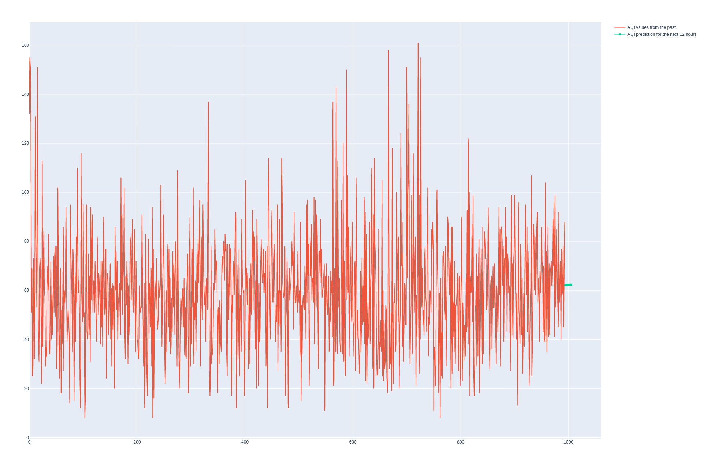
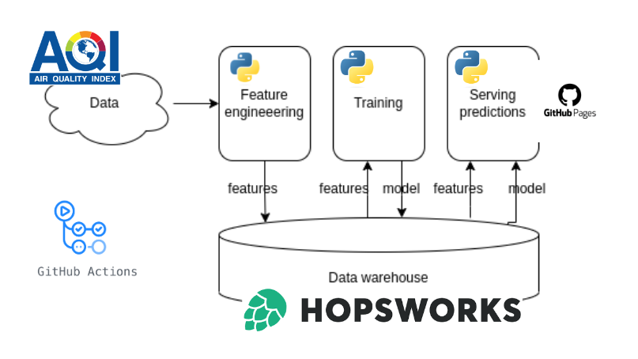

# MLOps-SKNI

## Air quality prediction for Warsaw 

## Architektura

Wymagania: bezpłatne konta na app.hopsworks.ai i github.com.

PLiki:
1. Github Actions: .github/workflows/*.yml każdorazowo przygotowują środowisko uruchomieniowe i wywołują określone skrypty:
	- features-pipeline.yml - w 30 minucie każdej godziny uruchamia skrypt features.py,
	- prediction-pipeline.yml - raz dziennie (o 1 w nocy) uruchamia skrypt predict.py i aktualizuje wykres w repozytorium,
	- training-pipeline.yml - raz dziennie (o północy) uruchamia skrypt train.py.
2. Skrypty w Pythonie:
	- features.py - z serwisu AQI pobiera dane o zanieczyszczeniu powietrza, a następnie zapisuje je w Hopsworks Feature Group "airquality",
	- train.py - wyciąga z Hopsworks dane o jakości powietrza, trenuje model i zapisuje go w serwisie,
	- predict.py - pobiera model wytrenowany wcześniej model z Hopsworks, dokonuje predykcji wartośći PM25 na kolejne 12 godzin i przygotowuje wykres z wartościami historycznymi i predykcjami.

## Kilka linków
Hopsworks Feature Store: https://docs.hopsworks.ai/feature-store-api/latest/
Dokumentacja Github Actions: https://docs.github.com/en/actions/quickstart
AQI: https://aqicn.org